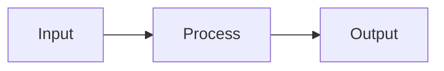

# README.md Generation Skill

## Purpose

This skill enables AI agents to create high-quality README.md files for GitHub repositories. The focus is on **clear, concise, factual documentation** that helps developers understand what the project does, why it exists, and how to use it — without marketing language, unnecessary verbosity, or irrelevant content.

---

## Core Philosophy

### What a README Should Be

A README is the **entry point** to your project. It answers three critical questions:

1. **What is this?** — Clear description of purpose and functionality
2. **Why does it exist?** — Problem it solves, use cases it addresses
3. **How do I use it?** — Installation, build, configuration, usage

### What a README Should NOT Be

- ❌ A marketing document with subjective claims ("robust", "blazing fast", "enterprise-grade")
- ❌ A comprehensive manual (link to docs instead)
- ❌ A contribution guide (use CONTRIBUTING.md)
- ❌ A changelog (use CHANGELOG.md or GitHub Releases)
- ❌ A dissertation on implementation details

### Guiding Principles

**Be factual, not promotional:**
- ✅ "Processes images using OpenCV and PIL"
- ❌ "Powerful and robust image processing library"

**Be concise, not verbose:**
- ✅ "A CLI tool for converting CSV to JSON"
- ❌ "This is an amazing command-line interface utility that provides users with the ability to seamlessly transform CSV files into JSON format"

**Be practical, not theoretical:**
- ✅ Show actual code examples that work
- ❌ Abstract descriptions without runnable code

**Be developer-focused:**
- Target: Developers who want to use or understand the project
- Not: General public, marketing stakeholders, or non-technical users

---

## README Structure

Every README should follow this logical flow. Sections can be adjusted based on project type, but the overall structure remains consistent.

### Standard Structure Template

```markdown
# Project Name

[Brief one-line description]

## Overview

[2-4 sentences explaining what the project does and why it exists]

## Features

[Bullet list of key capabilities - optional for simple projects]

## Prerequisites

[List of required software, versions, and system requirements]

## Installation

[Step-by-step installation instructions]

## Configuration

[How to configure the project - if applicable]

## Usage

[Basic usage examples with actual code]

## Examples

[More complex real-world examples - optional]

## API Reference

[Brief API overview with link to full docs - for libraries]

## Deployment

[Production deployment instructions - for applications]

## Architecture

[High-level architecture overview - for complex systems]

## License

[License information]
```

---

## Section Guidelines

### 1. Title and Badge Line

**Title:**
- Project name, clear and unambiguous
- No taglines or marketing slogans in the H1

**Badges (optional but recommended):**
- Build status (CI/CD pipeline)
- Latest version/release
- License type
- Language/framework version
- Test coverage (if meaningful)

```markdown
# image-optimizer

[](https://github.com/user/repo/actions)
[](https://pypi.org/project/image-optimizer/)
[](https://www.python.org/downloads/)
[](https://opensource.org/licenses/MIT)
```

### 2. Overview / Description

**Goal:** Answer "What is this?" in 2-4 sentences.

**Include:**
- What the project is (library, tool, application, service)
- Primary purpose and problem it solves
- Key technology stack (e.g., "Built with React and Node.js")
- Target use case or user

**Avoid:**
- Marketing language ("powerful", "robust", "enterprise-grade", "cutting-edge")
- Vague statements that don't provide concrete information
- Excessive detail (save for later sections)

```markdown
## Overview

image-optimizer is a command-line tool for batch processing images. It reduces 
file size by optimizing compression settings while preserving visual quality. 
Built with Python and uses Pillow and pngquant. Designed for web developers 
who need to optimize large collections of images for deployment.
```

### 3. Features (Optional)

**When to include:**
- Projects with multiple distinct capabilities
- When features are not obvious from the name

**Format:**
- Bullet list of concrete capabilities
- State facts, not opinions
- Keep each point to one line

```markdown
## Features

- Supports JPEG, PNG, WebP, and GIF formats
- Batch processing with parallel execution
- Preserves EXIF metadata
- Configurable quality settings per format
- Progress bar for long operations
```

### 4. Prerequisites

**Critical section:** List everything needed BEFORE installation.

**Include:**
- Operating system requirements (if specific)
- Required runtime (Python 3.10+, Node.js 18+, Java 17+, etc.)
- System dependencies (libpng, ffmpeg, Docker, etc.)
- Database systems (PostgreSQL 14+, Redis 6+, etc.)
- Hardware requirements (minimum RAM, disk space, GPU)

**Format:**
- Be specific with version numbers
- Explain where to get dependencies
- Separate required vs. optional prerequisites

```markdown
## Prerequisites

### Required

- Python 3.10 or higher ([download](https://www.python.org/downloads/))
- pip 21.0 or higher (included with Python)
- libpng 1.6+ (Linux: `apt install libpng-dev`, macOS: `brew install libpng`)

### Optional

- pngquant (for PNG optimization): https://pngquant.org/
- jpegoptim (for JPEG optimization): `apt install jpegoptim`
```

### 5. Installation

**Goal:** Get the project installed on the user's machine.

**Include:**
- Exact commands to run (copy-pasteable)
- Multiple installation methods if available (pip, npm, Docker, from source)
- Platform-specific instructions if needed
- How to verify installation succeeded

**Structure:**
1. Install from package manager (preferred)
2. Install from source (alternative)
3. Verification command

```markdown
## Installation

### Via pip (recommended)

```bash
pip install image-optimizer
```

### From source

```bash
git clone https://github.com/user/image-optimizer.git
cd image-optimizer
pip install -e .
```

### Verify installation

```bash
image-optimizer --version
# Output: image-optimizer 2.1.0
```
```

### 6. Configuration (if applicable)

**When to include:**
- Applications that need configuration before use
- Projects with environment variables
- Services with config files

**Include:**
- All configuration options with descriptions
- Default values
- Example configuration files
- Security notes (never commit secrets)

```markdown
## Configuration

### Environment Variables

Create a `.env` file or set these environment variables:

```bash
# API settings
API_KEY=your_api_key_here          # Required: Your service API key
API_ENDPOINT=https://api.example.com  # Optional: Custom API endpoint (default: prod)

# Processing settings
MAX_WORKERS=4                       # Optional: Parallel workers (default: 4)
MAX_FILE_SIZE_MB=50                # Optional: Max file size (default: 50)
```

### Configuration File

Alternatively, use `config.yaml`:

```yaml
api:
  key: "your_api_key_here"
  endpoint: "https://api.example.com"
  
processing:
  max_workers: 4
  max_file_size_mb: 50
```

Place this file in the project root or specify with `--config` flag.
```

### 7. Usage

**Critical section:** Show how to actually use the project.

**Include:**
- Basic usage example (minimum viable usage)
- Common use cases
- Input/output examples
- Command-line flags or API calls

**Format:**
- Start simple, then add complexity
- Use real, working examples
- Show expected output
- Include error cases if helpful

```markdown
## Usage

### Basic Example

```bash
# Optimize all images in a directory
image-optimizer input_images/ --output optimized/
```

### Common Use Cases

**Optimize with custom quality:**
```bash
image-optimizer input/ --output output/ --quality 85
```

**Preserve original dimensions:**
```bash
image-optimizer input/ --output output/ --no-resize
```

**Process only specific formats:**
```bash
image-optimizer input/ --output output/ --formats jpg,png
```

### Python API

```python
from image_optimizer import optimize

# Optimize single file
optimize('photo.jpg', output='photo_optimized.jpg', quality=85)

# Batch optimize directory
from image_optimizer import batch_optimize
batch_optimize('input_dir/', 'output_dir/', quality=85, parallel=True)
```

**Output:**
```
Processing: photo.jpg
Original: 2.4 MB → Optimized: 487 KB (79.7% reduction)
```
```

### 8. Examples (Optional - for complex projects)

**When to include:**
- When basic usage doesn't cover realistic scenarios
- For libraries with multiple use cases
- When integration patterns need demonstration

**Format:**
- Complete, runnable examples
- Real-world scenarios
- Integration with other tools/frameworks

```markdown
## Examples

### Integration with Web Framework

```python
from flask import Flask, request
from image_optimizer import optimize

app = Flask(__name__)

@app.route('/upload', methods=['POST'])
def upload_image():
    file = request.files['image']
    input_path = f"uploads/{file.filename}"
    output_path = f"optimized/{file.filename}"
    
    file.save(input_path)
    optimize(input_path, output=output_path, quality=85)
    
    return {"status": "success", "optimized_file": output_path}
```

### Batch Processing Pipeline

See [examples/batch_pipeline.py](examples/batch_pipeline.py) for a complete 
implementation of a multi-stage processing pipeline.
```

### 9. API Reference (for libraries)

**When to include:**
- Libraries with public APIs
- SDKs and frameworks

**Include:**
- High-level API overview
- Key classes/functions with brief descriptions
- Link to full API documentation

```markdown
## API Reference

### Core Functions

**`optimize(input_path, output=None, quality=85, format=None)`**

Optimize a single image file.

- `input_path` (str): Path to input image
- `output` (str, optional): Output path. If None, overwrites input.
- `quality` (int): Quality setting 1-100 (default: 85)
- `format` (str, optional): Force output format (jpg, png, webp)

Returns: `OptimizationResult` with file sizes and reduction percentage

**`batch_optimize(input_dir, output_dir, **options)`**

Optimize all images in a directory.

- `input_dir` (str): Input directory path
- `output_dir` (str): Output directory path
- `**options`: Same as `optimize()` function

Returns: `list[OptimizationResult]`

**Full API documentation:** https://image-optimizer.readthedocs.io/api/
```

### 10. Deployment (for applications)

**When to include:**
- Web applications
- Backend services
- Containerized applications

**Include:**
- Production deployment instructions
- Docker/Kubernetes configuration
- Environment-specific settings
- Scaling considerations

```markdown
## Deployment

### Docker

```bash
# Build image
docker build -t image-optimizer .

# Run container
docker run -v $(pwd)/images:/images image-optimizer /images
```

### Docker Compose

```yaml
version: '3.8'
services:
  optimizer:
    image: image-optimizer:latest
    volumes:
      - ./input:/input
      - ./output:/output
    environment:
      - MAX_WORKERS=8
      - QUALITY=85
```

### Production Considerations

- Set `MAX_WORKERS` based on available CPU cores
- Use a persistent volume for output files
- Monitor disk space as optimized files accumulate
- Set up log rotation for production deployments
```

### 11. Architecture (for complex systems)

**When to include:**
- Multi-component systems
- Microservices architectures
- Projects with non-obvious structure

**Include:**
- High-level architecture diagram
- Component descriptions
- Data flow
- Technology stack per component

```markdown
## Architecture

```
┌─────────────┐      ┌──────────────┐      ┌─────────────┐
│   CLI       │─────▶│  Processor   │─────▶│   Output    │
│  Interface  │      │   Engine     │      │   Writer    │
└─────────────┘      └──────────────┘      └─────────────┘
                            │
                            ▼
                     ┌──────────────┐
                     │  Optimization│
                     │   Plugins    │
                     └──────────────┘
```

**Components:**

- **CLI Interface**: Argument parsing and user interaction
- **Processor Engine**: Parallel processing coordinator
- **Optimization Plugins**: Format-specific optimizers (JPEG, PNG, WebP)
- **Output Writer**: File writing and metadata preservation

Built with Python 3.10+, using `concurrent.futures` for parallelization.
```

### 12. Troubleshooting (Optional)

**When to include:**
- Common error messages are known
- Installation has platform-specific issues
- Configuration errors are frequent

```markdown
## Troubleshooting

### Error: "libpng not found"

**Cause:** Missing system dependency.

**Solution:**
- Ubuntu/Debian: `sudo apt install libpng-dev`
- macOS: `brew install libpng`
- Windows: Download from http://www.libpng.org/pub/png/libpng.html

### Error: "Out of memory"

**Cause:** Processing very large images with limited RAM.

**Solution:** Reduce `MAX_WORKERS` or process files individually:
```bash
image-optimizer large_file.jpg --output optimized.jpg --max-workers 1
```
```

### 13. Screenshots and Demos (for UI applications)

**When to include:**
- Desktop applications with GUI
- Web applications
- CLI tools with rich output

**Format:**
- Place images in `docs/` or `assets/` directory
- Use relative paths in markdown
- Include captions
- Support both light and dark themes if possible

```markdown
## Screenshots

### Main Interface


### Batch Processing


### Live Demo

Try the web version: https://image-optimizer.demo.com
```

### 14. Testing (Optional)

**When to include:**
- Open source projects expecting contributions
- Projects with complex test setups

```markdown
## Testing

### Run tests

```bash
# Install dev dependencies
pip install -e ".[dev]"

# Run test suite
pytest

# Run with coverage
pytest --cov=image_optimizer --cov-report=html
```

### Run linters

```bash
ruff check .
ruff format .
mypy src/
```
```

### 15. License

**Always include license information.**

```markdown
## License

This project is licensed under the MIT License - see the [LICENSE](LICENSE) file for details.
```

---

## Project-Type Specific Guidelines

Different types of projects require different README emphases. Adapt the structure based on project type.

### Python Library

**Emphasis:**
- Installation via pip
- Python version requirements
- API documentation with type hints
- Usage examples (both imperative and API)
- Link to Sphinx/ReadTheDocs documentation

**Example structure:**
```markdown
# library-name

## Overview
[What it does]

## Installation
pip install library-name

## Quick Start
[Simple code example]

## Usage
[Detailed examples]

## API Reference
[Key classes/functions + link to full docs]

## License
```

### CLI Tool

**Emphasis:**
- Installation instructions (binary, package manager, from source)
- Command-line usage with flags
- Common use cases
- Configuration options
- Exit codes and error handling

**Example structure:**
```markdown
# tool-name

## Overview
[What it does]

## Installation
[Via package manager and from source]

## Usage
[Command examples with flags]

## Configuration
[Config file or environment variables]

## Examples
[Common workflows]

## License
```

### Web Application (Frontend)

**Emphasis:**
- Live demo link
- Screenshots/GIFs of UI
- Local development setup
- Build process
- Deployment options

**Example structure:**
```markdown
# app-name

## Overview
[What it does]

## Demo
[Live demo link]

## Screenshots
[UI images]

## Prerequisites
[Node.js version, etc.]

## Development
[npm install, npm run dev]

## Build
[npm run build]

## Deployment
[Vercel, Netlify, Docker, etc.]

## License
```

### Backend Service / API

**Emphasis:**
- API endpoints overview
- Configuration (environment variables, config files)
- Database setup
- Authentication/authorization
- Deployment (Docker, Kubernetes, cloud platforms)
- API documentation link

**Example structure:**
```markdown
# service-name

## Overview
[What it provides]

## Prerequisites
[Database, runtime, etc.]

## Configuration
[Environment variables, config.yaml]

## Database Setup
[Migrations, schema]

## Running Locally
[Development server]

## API Endpoints
[Brief overview + link to full API docs]

## Deployment
[Docker, cloud deployment]

## License
```

### Full-Stack Application

**Emphasis:**
- Architecture overview
- Prerequisites (frontend + backend)
- Setup for both parts
- Environment configuration
- Development workflow
- Deployment

**Example structure:**
```markdown
# app-name

## Overview
[What it is]

## Architecture
[High-level diagram]

## Prerequisites
[All dependencies]

## Setup
### Backend
[Backend setup steps]

### Frontend
[Frontend setup steps]

### Database
[Database setup]

## Development
[Running dev servers]

## Deployment
[Production deployment]

## License
```

### Data Science / ML Project

**Emphasis:**
- Dataset information
- Model architecture
- Training instructions
- Inference/prediction usage
- Results/metrics
- Notebooks link

**Example structure:**
```markdown
# project-name

## Overview
[Problem and approach]

## Dataset
[Data source, preprocessing]

## Model
[Architecture overview]

## Setup
[Dependencies, data download]

## Training
[How to train]

## Inference
[How to use trained model]

## Results
[Metrics, visualizations]

## Notebooks
[Link to Jupyter notebooks]

## License
```

### Mobile Application

**Emphasis:**
- Platform support (iOS, Android)
- Download links (App Store, Play Store)
- Screenshots
- Build instructions
- App features

**Example structure:**
```markdown
# app-name

## Overview
[What it does]

## Download
[App store links]

## Screenshots
[Mobile UI screenshots]

## Features
[Key capabilities]

## Development Setup
[Build environment]

## Building
[Build instructions]

## License
```

---

## What NOT to Include

### ❌ Don't Include (move to separate files instead)

**Contribution Guidelines** → `CONTRIBUTING.md`
```markdown
<!-- DON'T PUT IN README -->
## Contributing
We welcome contributions! Please follow these steps:
1. Fork the repository
2. Create a feature branch
3. Submit a pull request

<!-- USE CONTRIBUTING.md INSTEAD -->
```

**Detailed Changelog** → `CHANGELOG.md` or GitHub Releases
```markdown
<!-- DON'T PUT IN README -->
## Changelog

### v2.1.0 (2025-01-15)
- Added support for WebP
- Fixed memory leak in batch processing
- Updated dependencies

<!-- USE CHANGELOG.md INSTEAD -->
```

**Code of Conduct** → `CODE_OF_CONDUCT.md`

**Security Policy** → `SECURITY.md`

**Detailed API Documentation** → ReadTheDocs, GitHub Pages, or dedicated docs site

**Extensive Tutorials** → Separate documentation site or wiki

---

## Markdown Best Practices

### Formatting

**Headers:**
- Use ATX-style headers (`#`, `##`, `###`)
- One H1 only (project title)
- Logical hierarchy (H2 for sections, H3 for subsections)

**Code blocks:**
- Always specify language for syntax highlighting
- Use backticks for inline code
- Use triple backticks for blocks

```markdown
`inline code`

```python
# Code block with syntax highlighting
def hello():
    print("Hello, World!")
```
```

**Lists:**
- Use `-` for unordered lists (consistent with most projects)
- Use `1.` for ordered lists
- Indent nested lists with 2 or 4 spaces

**Links:**
- Use descriptive text, not "click here"
- Use relative paths for internal links
- Use absolute URLs for external links

```markdown
Good: See the [installation guide](docs/install.md)
Bad: Click [here](docs/install.md) for installation
```

**Images:**
- Use relative paths: ``
- Always include alt text
- Keep images in `docs/`, `assets/`, or `.github/` directory

**Tables:**
- Use for structured data only
- Keep them simple and readable

```markdown
| Command | Description |
|---------|-------------|
| `build` | Compile the project |
| `test`  | Run test suite |
```

### Visual Elements

**Badges:**
- Place immediately after H1 title
- Group related badges (build, version, coverage)
- Use shields.io for consistency

**Collapsible Sections (for long content):**
```markdown
<details>
<summary>Advanced Configuration Options</summary>

[Long content here that doesn't clutter the main README]

</details>
```

**Diagrams:**
- Use ASCII art for simple diagrams
- Use Mermaid for complex diagrams (GitHub supports it)



---

## Anti-Patterns to Avoid

### ❌ Marketing Language

```markdown
<!-- BAD -->
## Overview
Our robust, enterprise-grade solution delivers blazing-fast performance with 
cutting-edge AI-powered optimization, providing unparalleled reliability and 
scalability for mission-critical workloads.

<!-- GOOD -->
## Overview
A command-line tool that optimizes images by reducing file size while preserving 
quality. Uses modern compression algorithms (pngquant, jpegoptim). Designed for 
batch processing large image collections.
```

### ❌ Vague Instructions

```markdown
<!-- BAD -->
## Installation
Install the dependencies and build the project.

<!-- GOOD -->
## Installation
```bash
npm install
npm run build
```
```

### ❌ Missing Prerequisites

```markdown
<!-- BAD -->
## Installation
Clone and run npm install.

<!-- GOOD -->
## Prerequisites
- Node.js 18+ ([download](https://nodejs.org/))
- npm 9+ (included with Node.js)

## Installation
```bash
git clone https://github.com/user/repo.git
cd repo
npm install
```
```

### ❌ Example Code That Doesn't Work

```markdown
<!-- BAD -->
```python
# This won't actually run
optimizer.optimize_everything()
```

<!-- GOOD -->
```python
from image_optimizer import optimize

# Optimize a single file
result = optimize('input.jpg', output='output.jpg', quality=85)
print(f"Reduced file size by {result.reduction_percent}%")
```
```

### ❌ Dumping Everything in README

Keep README focused. If sections grow too large:
- Create separate documentation
- Link to it from README
- Keep README as the entry point, not the encyclopedia

---

## AI Agent Workflow

When generating a README, follow this systematic process:

### Step 1: Analyze the Project

**Gather information:**
- [ ] Project language/framework (Python, Node.js, React, etc.)
- [ ] Project type (library, CLI, web app, API, etc.)
- [ ] Core functionality and purpose
- [ ] Dependencies and prerequisites
- [ ] Installation method (pip, npm, Docker, etc.)
- [ ] Configuration requirements
- [ ] Entry points (main command, import statements, etc.)

**Scan the codebase:**
- Read `package.json`, `pyproject.toml`, `Cargo.toml`, etc.
- Check for existing README to preserve relevant content
- Look at main entry files (`main.py`, `index.js`, `cmd/main.go`)
- Review documentation in code comments
- Check for examples directory
- Identify test files to understand usage patterns

### Step 2: Determine README Structure

**Based on project type, select appropriate structure:**

| Project Type | Priority Sections |
|--------------|-------------------|
| Library | Overview, Installation, Usage, API Reference, Examples |
| CLI Tool | Overview, Installation, Usage (commands), Configuration, Examples |
| Web App | Overview, Demo, Screenshots, Development Setup, Deployment |
| Backend API | Overview, Prerequisites, Configuration, API Endpoints, Deployment |
| Data/ML | Overview, Dataset, Model, Training, Inference, Results |

### Step 3: Write Each Section

**Follow section guidelines:**
1. Start with title and badges
2. Write overview (2-4 sentences, factual)
3. List prerequisites (specific versions)
4. Provide installation steps (tested commands)
5. Show configuration options (if needed)
6. Demonstrate usage (working examples)
7. Add advanced examples (optional)
8. Include API reference (for libraries)
9. Document deployment (for apps/services)
10. Add license information

### Step 4: Verify Quality

**Check against these criteria:**

- [ ] **Clarity**: Can a new developer understand and use the project?
- [ ] **Completeness**: Are all necessary sections present?
- [ ] **Accuracy**: Do all commands and examples work?
- [ ] **Conciseness**: Is every sentence necessary?
- [ ] **Factual**: No marketing language or subjective claims?
- [ ] **Actionable**: Can users copy-paste commands and succeed?
- [ ] **Professional**: Proper formatting, no typos?

### Step 5: Format and Polish

**Apply markdown best practices:**
- [ ] Code blocks have language specified
- [ ] Relative links for internal files
- [ ] Consistent list formatting
- [ ] Proper header hierarchy
- [ ] Images have alt text
- [ ] No broken links

---

## Quality Checklist

Before finalizing a README, verify:

### Content Quality
- [ ] Overview explains what, why, and how in 2-4 sentences
- [ ] No marketing language ("robust", "powerful", "enterprise-grade")
- [ ] All prerequisites listed with version numbers
- [ ] Installation instructions are complete and tested
- [ ] Usage examples are copy-pasteable and working
- [ ] Configuration options documented if applicable
- [ ] Links to additional documentation provided

### Structure Quality
- [ ] Logical flow from overview → installation → usage
- [ ] Appropriate sections for project type
- [ ] Headers follow hierarchy (one H1, logical H2/H3 structure)
- [ ] No duplicate information across sections
- [ ] Contributing/changelog in separate files (not README)

### Technical Quality
- [ ] Code blocks have syntax highlighting
- [ ] Commands are exact and tested
- [ ] File paths are correct (relative for internal, absolute for external)
- [ ] Examples show expected output when helpful
- [ ] Error cases addressed in troubleshooting (if needed)

### Formatting Quality
- [ ] Consistent markdown style
- [ ] Proper use of inline code (backticks)
- [ ] Tables formatted correctly
- [ ] Lists properly indented
- [ ] No excessive whitespace

### Accessibility
- [ ] Images have descriptive alt text
- [ ] Links have descriptive text (not "click here")
- [ ] Content works in both light and dark themes
- [ ] Badges don't rely solely on color to convey information

---

## Special Considerations

### For Existing Projects

When a README already exists:

1. **Preserve valuable content:**
   - Keep working examples
   - Maintain accurate technical information
   - Preserve relevant history or context

2. **Update outdated sections:**
   - Installation instructions for current version
   - Configuration options
   - Command-line flags
   - API changes

3. **Remove cruft:**
   - Old version information (move to CHANGELOG)
   - Outdated dependencies
   - Marketing language
   - Duplicate information

4. **Improve structure:**
   - Reorganize into logical sections
   - Add missing prerequisites
   - Enhance examples with working code

### For Private/Enterprise Repositories

**Adjust for internal audience:**
- Assume some shared knowledge (company tech stack)
- Include links to internal resources (wikis, docs)
- Document internal tooling usage
- Include team contact information

**Security considerations:**
- Never include credentials or API keys
- Don't document internal network topology
- Redact sensitive business logic
- Use placeholder values in examples

```markdown
## Configuration

```bash
# ❌ DON'T: Actual credentials
export API_KEY=prod_abc123xyz789secret

# ✅ DO: Placeholders
export API_KEY=your_api_key_here
```
```

### For Multilingual Projects

**For international projects:**
- Primary README in English (README.md)
- Translations in separate files (README.es.md, README.zh.md)
- Link to translations from main README

```markdown
# Project Name

[English content]

---

**Translations:**
- [Español](README.es.md)
- [中文](README.zh.md)
```

### For AI/ML Projects

**Special considerations:**
- Dataset information (source, size, license)
- Model architecture details
- Training requirements (GPU, time estimates)
- Pre-trained model links
- Performance metrics
- Inference examples

---

## Common Mistakes and How to Fix Them

### Mistake 1: README as Marketing Brochure

```markdown
❌ BAD:
"Our cutting-edge, AI-powered platform revolutionizes data processing with 
unparalleled performance and enterprise-grade reliability."

✅ GOOD:
"A data processing pipeline that uses machine learning to classify documents. 
Processes 1000 documents per minute on a single CPU core. Built with Python 
and scikit-learn."
```

### Mistake 2: Assuming Context

```markdown
❌ BAD:
## Installation
Run the install script.

✅ GOOD:
## Installation

### Prerequisites
- Python 3.10+
- PostgreSQL 14+

### Steps
```bash
git clone https://github.com/user/project.git
cd project
./scripts/install.sh
```
```

### Mistake 3: Incomplete Examples

```markdown
❌ BAD:
```python
import mylib
mylib.process()
```

✅ GOOD:
```python
from mylib import DataProcessor

# Initialize processor with config
processor = DataProcessor(batch_size=100, workers=4)

# Process data
result = processor.process('input.csv')
print(f"Processed {result.row_count} rows in {result.elapsed_time}s")
```
```

### Mistake 4: Missing Error Handling Context

```markdown
❌ BAD:
Run the command to start the server.

✅ GOOD:
## Usage

Start the development server:
```bash
npm run dev
```

The server will start on http://localhost:3000

**Troubleshooting:**
- If port 3000 is already in use, set `PORT=3001` environment variable
- If dependencies are missing, run `npm install` first
```

### Mistake 5: Overwhelming with Information

```markdown
❌ TOO MUCH IN README:
[10 pages of API documentation]
[Complete architecture specs]
[Detailed contribution guidelines]
[Full changelog]

✅ GOOD APPROACH:
## API Reference

Key functions:
- `process()` - Process data
- `validate()` - Validate input

**Full API documentation:** https://docs.project.com/api
```

---

## Final Checklist for AI Agents

Before presenting a README to the user, verify:

### Must Have
- [ ] Clear, factual overview (no marketing language)
- [ ] Complete prerequisites with versions
- [ ] Working installation instructions
- [ ] At least one usage example with code
- [ ] License information

### Should Have
- [ ] Project badges (build status, version, license)
- [ ] Configuration section (if applicable)
- [ ] Multiple usage examples for libraries
- [ ] Link to additional documentation
- [ ] Troubleshooting section (for common issues)

### Nice to Have
- [ ] Screenshots (for UI applications)
- [ ] Architecture diagram (for complex systems)
- [ ] Performance benchmarks (if relevant)
- [ ] Live demo link (for web applications)

### Must NOT Have
- [ ] ❌ Marketing language ("robust", "blazing fast", "enterprise-grade")
- [ ] ❌ Contribution guidelines (use CONTRIBUTING.md)
- [ ] ❌ Detailed changelog (use CHANGELOG.md)
- [ ] ❌ Vague instructions without actual commands
- [ ] ❌ Examples that don't work

---

## Summary

The best README is:

1. **Factual** — States what the project does without embellishment
2. **Concise** — Every sentence serves a purpose
3. **Actionable** — Readers can copy-paste commands and succeed
4. **Complete** — All information needed to use the project
5. **Well-structured** — Logical flow from overview to usage
6. **Professional** — Proper formatting, no typos, working links

**The ultimate test:** Can a competent developer who has never seen your project understand what it does, install it, configure it, and use it successfully by reading only the README?

If yes, you've written a good README.
